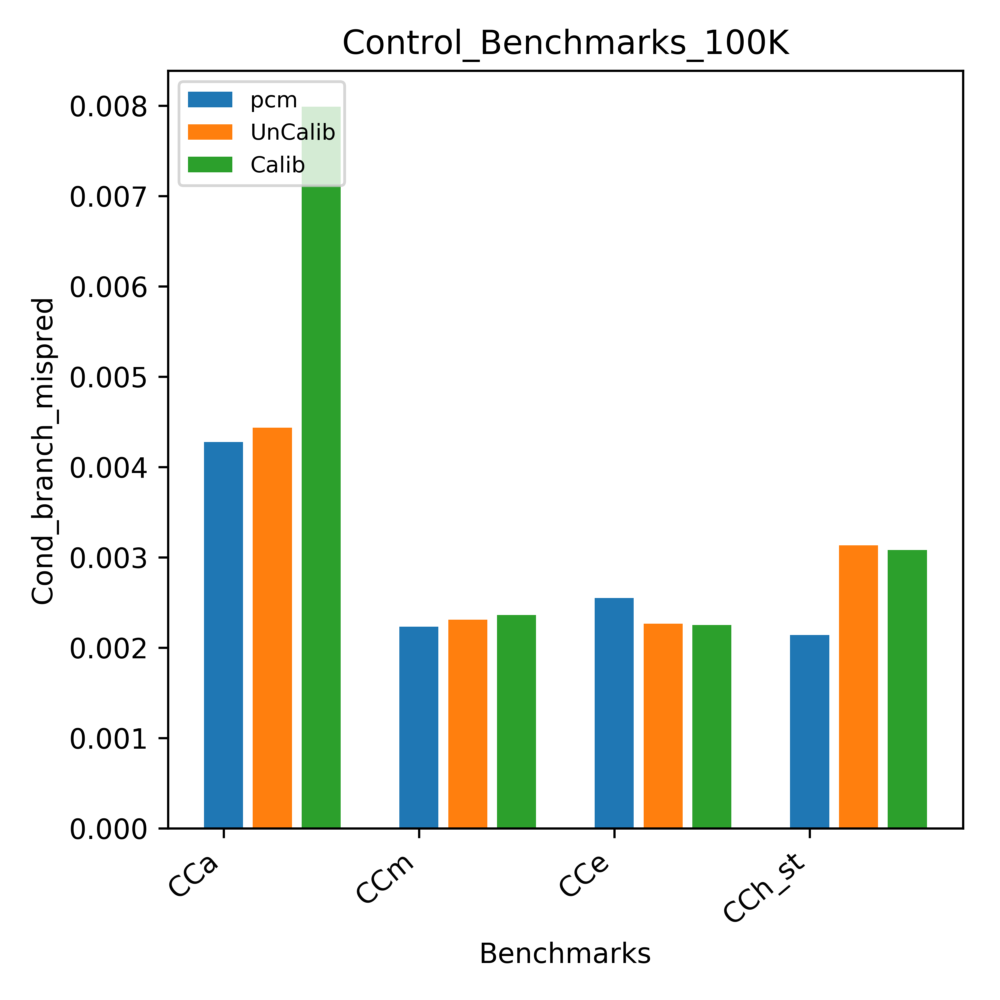
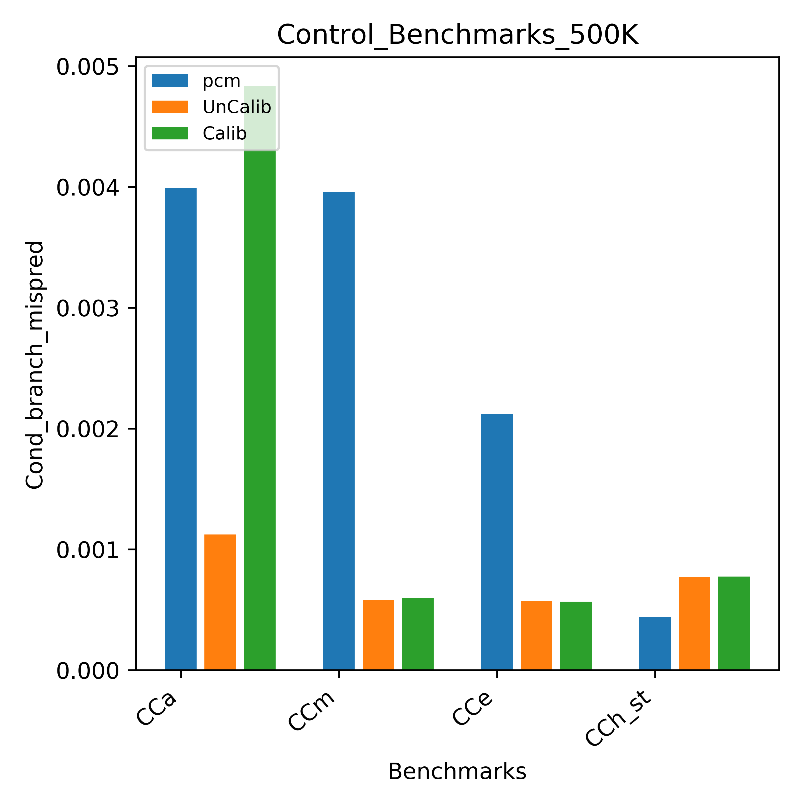
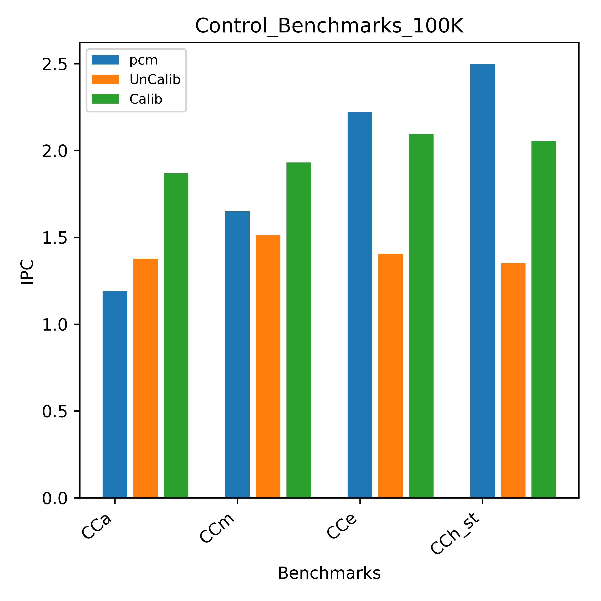

# Control Benchmarks 

The suite of control conditional benchmarks which is a part of the [university of wisconsin micro-benchmarks suite](https://github.com/VerticalResearchGroup/microbench) can be used to try and understand the difference in performance between the intel skylake processor and the branch prediction unit in gem5.

Control Conditional Benchmarks:

- CCa : completely baised branches

- CCe : easy to predict -- branch pattern (10101010...)

- CCm : heavly baised branches

- CCh_st : impossible to predict with a store operation

**Understanding the role of Branch Miss-Predictions**

Inorder to understand the role of branch predictors, we take a  closer look into it by ploting the conditional branch misprediction rate while using LTAGE branchmispredictor (which is the best branchpredictor)

The misprediction rate is almost same as the intel pcm for both UnCalibrated and Calibrated CPU. 

While increasing the iteration to '500K', the misprediction comes down for gem5 while using LTAGE because LtAGE has a bigger history table, therefore gets better with increase in iterations.

## Conclusion:

As we can see, the IPC for gem5 configured to model skylake architecture with LTAGE branchPredictor for '100K' iteration of the above benchmarks is almost same as the performance of the Intel processor measured using intel pcm for 'Calib CPU', after Calibrating the CPU w.r.t execution benchmarks the IPC is increased significantly and is almost equal to the intel pcm values.

