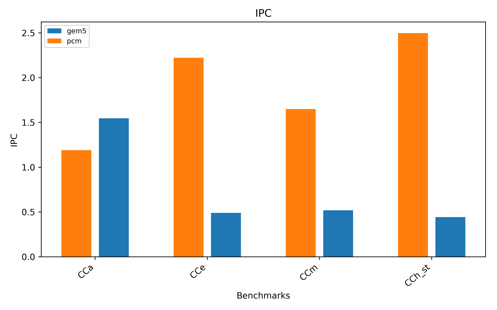
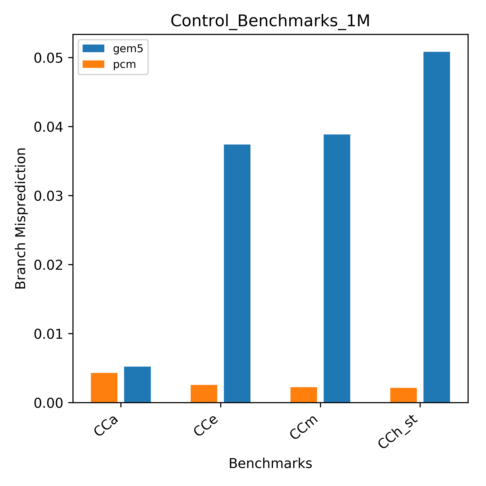
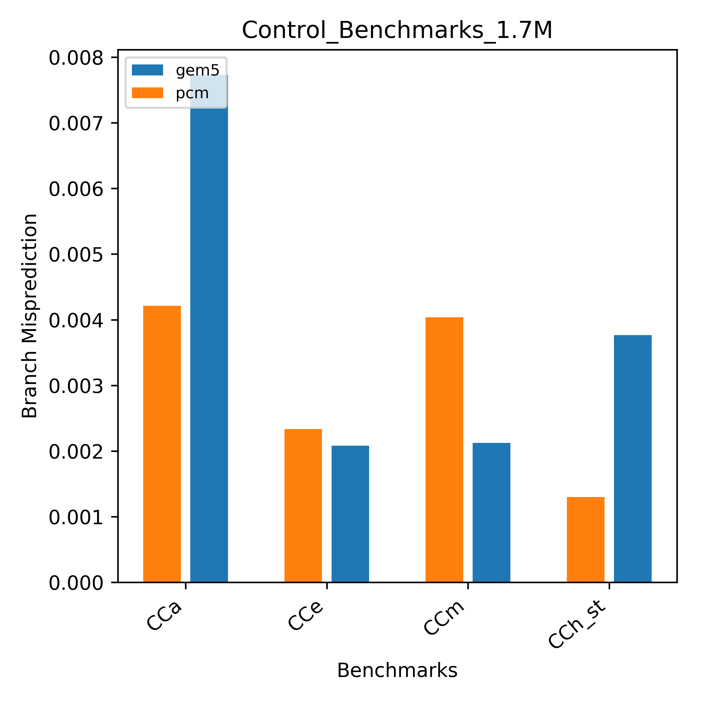
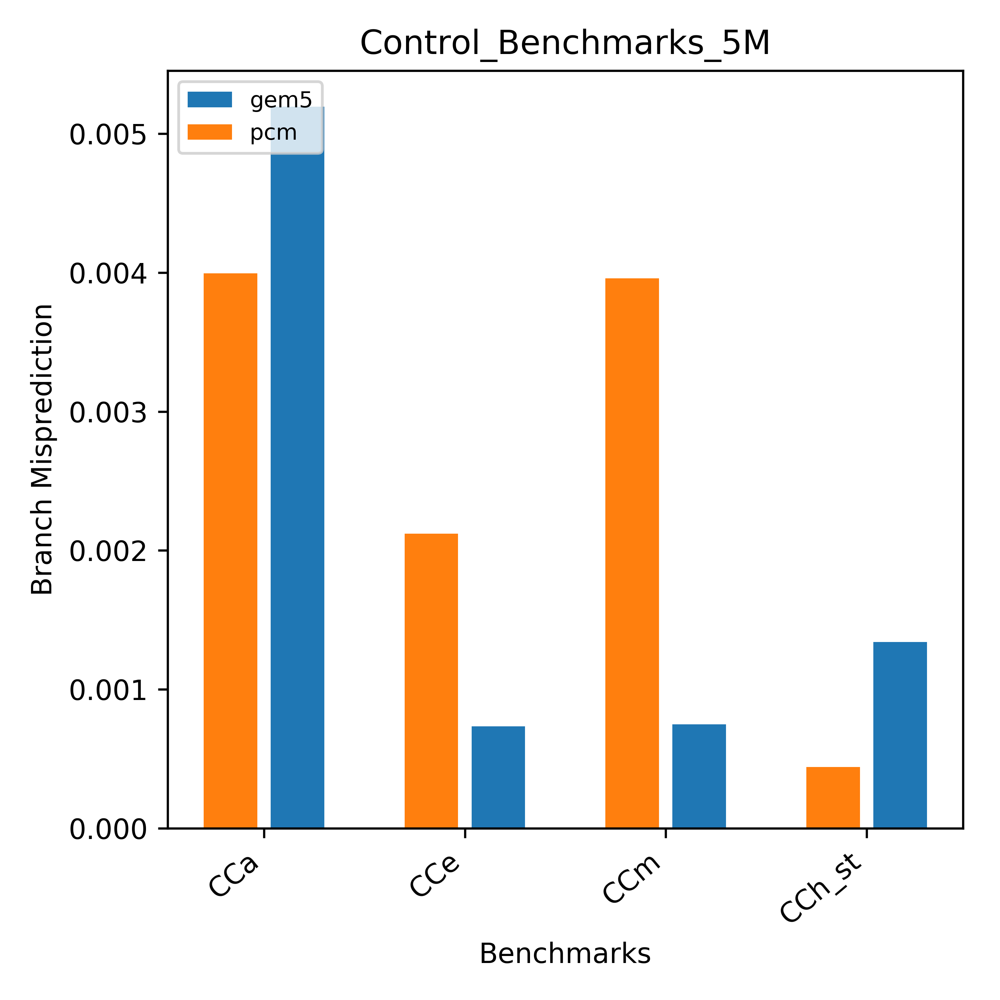
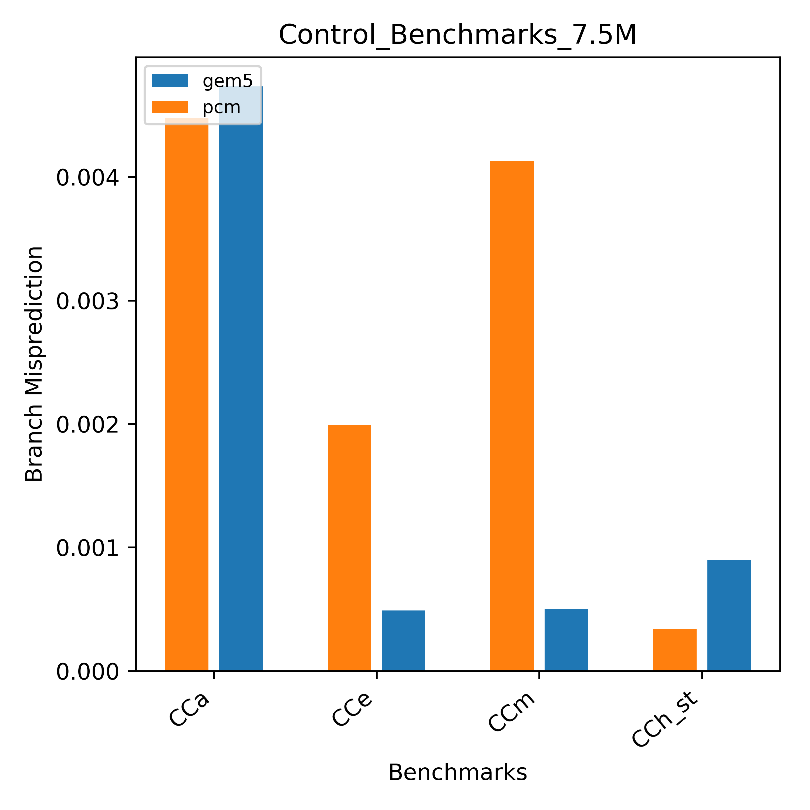
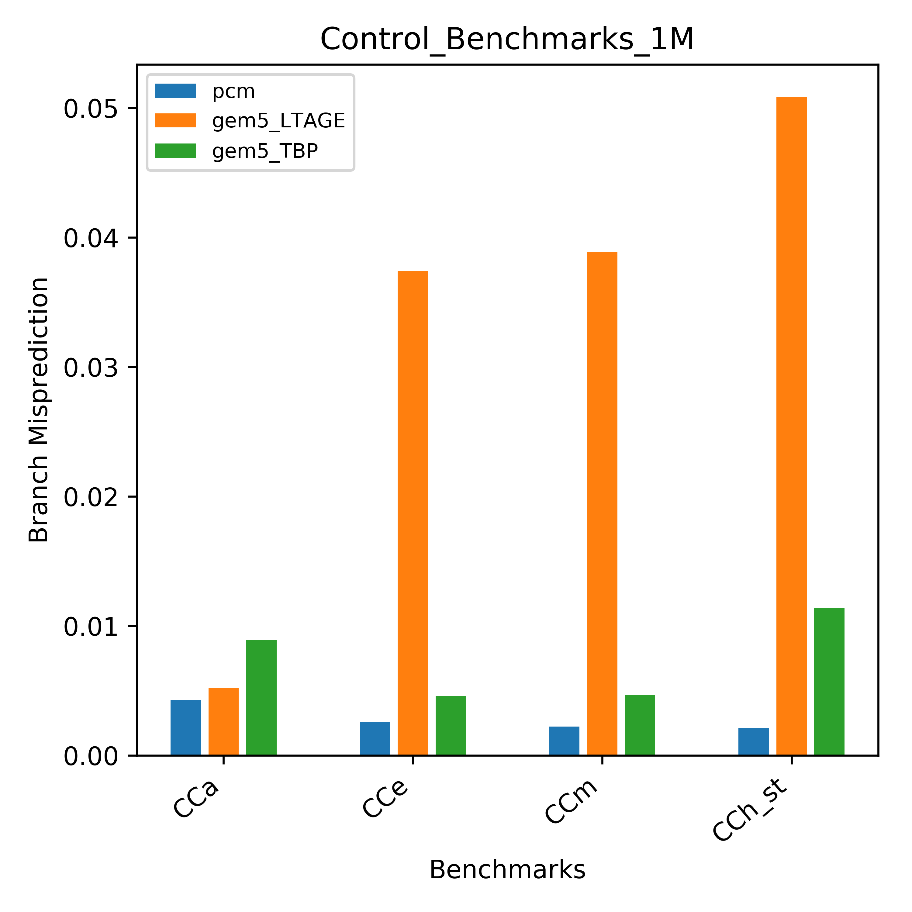
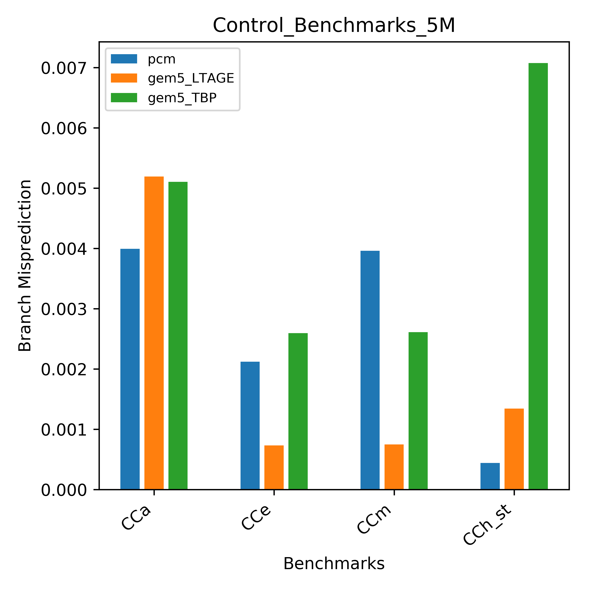

# Control Benchmarks 

The suite of control conditional benchmarks which is a part of the [university of wisconsin micro-benchmarks suite](https://github.com/VerticalResearchGroup/microbench) can be used to try and understand the difference in performance between the intel skylake processor and the branch prediction unit in gem5.

Control Conditional Benchmarks:

- CCa : completely baised branches

- CCe : easy to predict -- branch pattern (10101010...)

- CCm : heavly baised branches

- CCh_st : impossible to predict with a store operation

**IPC**

As we can see, the IPC for gem5 configured to model skylake architecture with LTAGE branchPredictor for '100K' iteration of the above benchmarks is less than the performance of the Intel processor measured using intel pcm.

To look into it more closely we plot the conditional branch misprediction rate.
Increasing the total number of iterations in the benchamrks, decreases misprediction rate in both intel processor and gem5.

**Effect of increasing Iterations:**

For '100K' Iteration the average difference between gem5 and the pcm is very high, but as we increase the number of iterations the gem5 misprediction rate comes down closer to pcm value, and increasing it further even gives better performance than pcm.

The gem5 model of skylake uses LTAGE branchpredictor, the LTAGE predictor has (To do : write the features of LTAGE predictor)., the warmup period of this predictor might be the reason for high misprediction for lesser iterations. 

Even for extremely difficult to predict benchmark *CCh_st* : The average difference between the two reduces significantly. 

**Using a different Branch Predictor:**

When we use a tournament branch predictor which supposedly would have lesser warmup period than LTAGE predictor, the branch misprediction rate for '100K' iteration is much less than LTAGE prediction and is close to pcm value, but as we increase the number of iterations in the benchmark the tournament predictor performance drops compared to both LTAGE and pcm performance.

This shows after the warmup period LTAGE performs better than other branch predictors.
