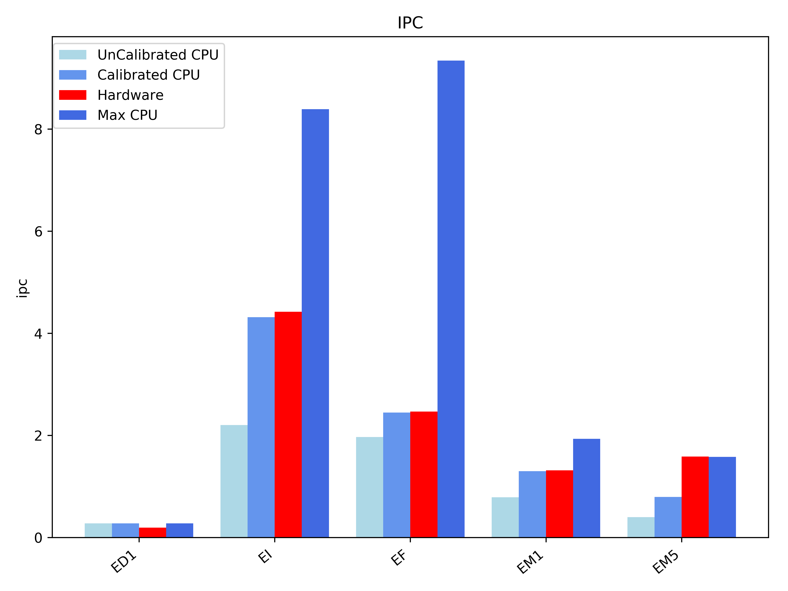

This documents describes preliminary analysis of few topics for configuring skylake micro-architecture in gem5. 

These are the CPU classes that configured in core.py
* UnCalibCPU: configured based on the documentation available for the micro-architecture, no extra offsetting is done inorder to match hardware performance.
* CalibCPU: considering the absence of certain features in gem5, for example, gem5 doesn't support micro-op fusion and micro-op cache, this configuration offsets those difficiencies by improving some other parameters.
* MaxCPU: models a CPU with maximum pipeline widths, minimum pipeline and instruction latencies.

### Difference between UnCalib and Calib configs
**Note**: Memory system is not calibrated yet so, it is same for both
|     Parameters     |        UnCalib        |        Calib          |         MAX           |
|--------------------|-----------------------|-----------------------|-----------------------|
| IntAlu             | count=4, latency=1    | count=7, latency=1    | count=32, latency=1   |
| IntMult            | count=1, latency=4    | count=1, latency=2    | count=32, latency=1   |
| SIMD_unit          | count=2, latency=same | count=2, latency=same | count=32, latency=1   |
| SIMD_Mult          | count=2, latency=5    | count=2, latency=4    | count=32, latency=1   |
| Pipeline width     | width=4, latency=same | width=7, latency=same | width=32, latency=1   | 

#### Missing Features:
There are few features that are not modeled in gem5. Therefore, some offsetting has to done in order match the hardware performance.

**Micro-op cache**: It holds the predecoded instructions, feeds them directly to the allocation queue (IDQ) and provides a fast access to micro-ops with 1 cycle latency. Since this feature is absent in gem5, the L1 instruction cache latency of skylake config in gem5 is configured to match micro-op cache latency, instead of 4 cycle latency which is the actual hardware latency.

**Micro-op fusion**: The hardware in certain cases fuses few simple micro-ops into one complex micro-op to performance, this feature is absent in gem5. In order to match the performance, the pipeline widths are scaled from 4 to 7, below figure, which is plot of IPC for execution core shows, the effect of this scaling of pipeline widths Calib CPU with respect to hardware and uncalibrated configuration.

**SIMD Vs Vector**: This [manual](https://www.agner.org/optimize/microarchitecture.pdf) provides information about vector intruction latencies, which when directly configured with the SIMD instructions in gem5, the performance doesn't match the hardware, in the figure, we can see how badly the UnCalib CPU compares to hardware for EM1 and EM5. These benchmarks test SIMD multiplier unit in CPU, EM1 has just one multiplication in a loop and EM5 has 5 dependent multiplications in same loop. By adjusted SIMD multiplication latency, we can see Calib CPU closely matches hardware IPC. Adding to this, I currently do not have correct understanding of relationship between producer-consumer micro-op flow in gem5, which might also have an impact on the result.

**Instruction categorization**: In gem5, for example, the shift operations and few other slow int operations are grouped under one enum IntAlu. But, we need to have different number of these units to order match the hardware configuration. A study is yet to made on real workloads to see the frequency of these instructions. A possible solution is to create seperate enum class for slowInt and other instruction classes in gem5.  

