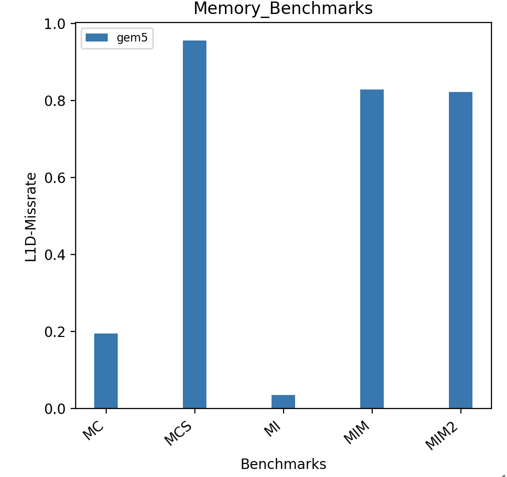

# Memory Benchmarks

## Benchmarks Used

The suite of memory benchmarks which is a part of the [university of wisconsin micro-benchmarks suite](https://github.com/VerticalResearchGroup/microbench) and targets specially the L1 cache miss performance can be used to analyse the performance difference between gem5 and real hardware system.

- MC:  Benchmark with load instructions, generates many Conflict Misses.
- MCS: Benchmark with store instructions, generates many Conflict Misses.
- MD : Benchmark containing cache resident linked list transversal.
- MI : Independent memory access stored in static array, this benchmark has good spatial and temporal locality.
- MIM :Independent memory access stored in static array, this benchmark has very bad spatial locality.
- MIM2 :Same as MIM, but it has 2 extra coalescing ops in between.

## gem5 results:

The gem5 results look analytically correct, the MI benchmark which is supposed to have the least missrate theoretically does so as seen in the graph. The MIM and MIM2 benchmarks have bad spatial and temporal locality hence have a very high missrate. The MCS and MC benchmark refelct the cache model beahviour when a conflict miss occurs. The MCS benchmark has more missrate than MC because of the differenc ein store bandwidth, store queue entry size and various other factors in our skylake architecture configuration in gem5.

## gem5 vs Hardware values

As we have mirrored the memory model configuration in gem5 as close as possible to the intel skylake architecture, we expect to see almost similar missrate in gem5 and intel pcm values. 

From the above graph, it is evident that there is some feature in the hardware which makes it oerform well even for benchmarks that tend to have a higher missrate. This is mostly because of the fact that the strideprefecther and prefecthing techniques supported and modeled in gem5 classic cache model is not as good as the ones found in hardware.

## Other missing features

There are other features in gem5 cache model that are not immediately available to mode the memory model to represent a real system like intel skylake architecture. 
- Multi-level TLB support for X86 is not currently found in gem5. 
- The MSHR in the real system also doubles as a line buffer or filter cache between the L1 Cache and the CPU. This feature is also missing in gem5.

These features can be incorporated into the source code of gem5 X86 model to make it easier to configure it to model a real world X86 processor.