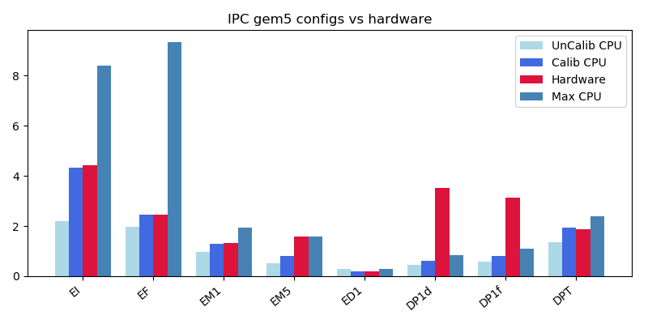
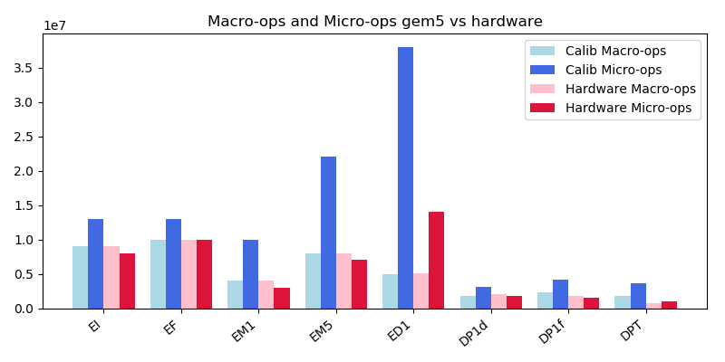
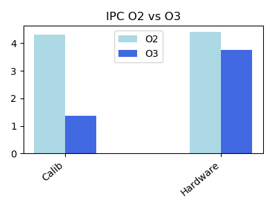
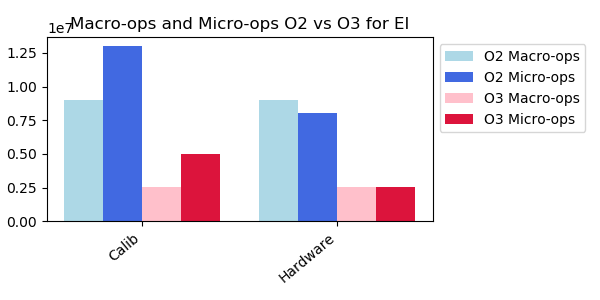

# Benchmark Analysis

## Execution Core Benchmarks

| **Benchmarks** |  **Description**  |
|----------------|-------------------|
| EI         | Independent integer arithmetic |
| EF         | Independent FP arithmetic |
| ED1        | Division, Length 1 Dependency Chain per Iteration  |
| EM1        | Multiply, Length 1 Dependency Chain per Iteration |
| EM5        | Multiply, Length 5 Dependency Chain per Iteration |
| DP1d       | Double precision FP arithmetic |
| DP1f       | Single precision FP arithmetic |
| DPT        | Sin() computation |
| DPTd        | Sin() computation double precision|



Figure 1: IPC gem5 configs vs hardware (binaries compiled with O2 flag, loop unrolling and peeling disabled)

### EI and EF

These benchmarks have independent arithmetic instructions in a simple for loop, and is a good test for measuring effect of pipeline widths, instruction latencies and operation fusion. From Figure 1, the IPC of hardware for EI is around 4.5 even though it can only only retire 4 instruction per cycle, which indicates the possibility of using few simple macro-ops into one complex micro-op. Figure 2 shows that for EI, hardware has less micro-ops than macro-ops. The IPC of EI for UnCalib CPU is less than that of the hardware because, gem5 currently doesn't support macro-op and micro-op fusion, which implies, gem5 will execute less number of instructions per cycle compared to the hardware for the same pipeline width. Therefore in order to match the performance, the pipeline widths in Calib CPU are increased to 7.

Another interesting case to look at is impact of compiler optimization flags on IPC. From figure 3, ``O2`` flag gives better performance for both hardware and Calib CPU than ``O3``. From the below assembly codes for EI with different flags show that, ``O3`` generates packed addition instructions, which indicates that, there is no instruction fusion therefore, lower IPC in case of hardware. But this doesn't explain why Calib CPU with wider pipeline has less IPC than the hardware. Looking at the gem5 stats reveals that, for ``O3`` in case of EI, 30.1% of the operations belong to IntALU and 69.8% are SIMD adds, whereas for ``O2``, 99.9% of the operations in gem5 belong to IntALU class. Even though the SIMD add has same latency as add in IntALU, why is the performance of gem5 for ``O3`` worse than ``O2`` in case of EI?, figure 4 shows that, for EI compiled with ``O3``, gem5's Calib CPU executes more micro-ops than the hardware. Is gem5's decoding of macro-ops into more micro-ops the reason for reduction in performance? not sure!. For other benchmarks listed above, there is not much difference in IPC with respect to ``O2`` or ``O3`` but, from Figure 2 we can see that, gem5 decodes more micro-ops than the hardware.

For EF, apart from adjusting pipeline width as described above, the instruction latency of SIMDFLOATMUL was reduced to 4 from 5 in order to match the performance

**O2:**

``` add    %edi,%edx
    add    %edi,%r9d
    add    %edi,%eax
    add    %edi,%r8d
    add    %edi,%esi
    add    %edi,%ecx
    add    $0x1,%edi
    cmp    $0xf4240,%edi
    jne    400ba0 <loop+0x30>
```

**O3:**

``` add    $0x1,%eax
    paddd  %xmm0,%xmm3
    paddd  %xmm0,%xmm1
    cmp    %eax,%edx
    paddd  %xmm0,%xmm2
    paddd  %xmm0,%xmm4
    paddd  %xmm0,%xmm5
    paddd  %xmm0,%xmm6
    paddd  %xmm7,%xmm0
    ja     400bd8 <loop+0x68>
```



Figure 2: gem5 vs hardware IPC



Figure 3: gem5 vs hardware IPC



Figure 4: gem5 vs hardware macro and micro ops

### ED1

This benchmark has a single integer division operation in a for loop, gem5 performance is close to the hardware, in oder to make it more accurate, operation latency of division instruction was increased to 2. From figure 1, Calib CPU matches hardware IPC after this calibration.

### EM1 and EM5

These benchmarks are test for the multiplication operation, EM1 has one multiplication operation and EM5 has five dependent operations in simple for loop. In order to match the performance of gem5 with the hardware, the instruction latency of IntMul was reduced to 2 from 4. From figure 1, we can see Calib CPU matches hardware IPC for EM1. But couldn't match with hardware for EM5 even with same latency, increasing multiply units and pipelining the multiplication. Max CPU matches the performance of hardware but, the latency of multiply instruction is 1. This suggests that hardware might have some efficient multiplier which is not modeled in gem5.  

### DP1f and DP1d

These benchmarks are test for floating point arithmetic, DP1f has single precision arithmetic and DP1d has double precision in simple for loop. Couldn't match to performance of hardware even with increasing FP ALU units and reducing the latency.

```for(iters=zero; iters < ITERS; iters+=1) {
    for(i=zero; i < ASIZE; i+=1) {
      arrA[i]=arrA[i]*3.2 + arrB[i];
    }
    t1+=arrA[ASIZE-1];
  }
  ```

### DPT and DPTd

These benchmarks performance sin function computation single and double precision respectively, Calib CPU's performance is close to hardware in case of DPT. Couldn't run DPTd with gem5, had segmentation fault but, could run it on the hardware.
